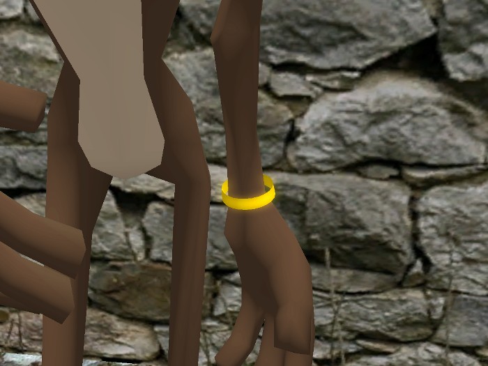
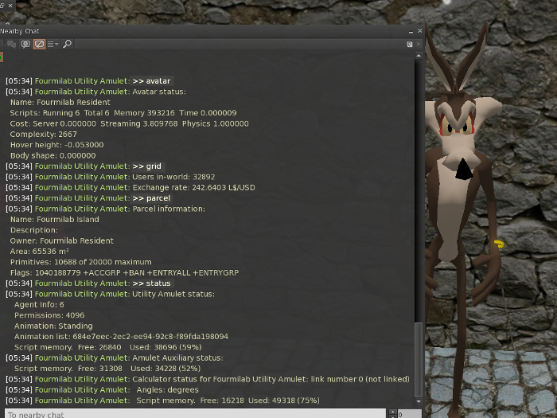

# Fourmilab Utility Amulet

[Fourmilab Utility Amulet](https://marketplace.secondlife.com/p/Fourmilab-Utility-Amulet/20582319)
is a wearable accessory which provides a variety of services
useful to developers and explorers of the Second Life virtual
world. The amulet has the form of a golden bracelet worn by
default on the left hand (you can change the attach point
and position on the body if you wish—it is not “rigged” to the
avatar skeleton). It accepts commands submitted on local chat
channel 77 by the wearer and responds in local chat to the wearer.

To use the Utility Amulet, simply add it to your outfit.  Chat commands
provide access to the following services.

* Play animations from the object's inventory or standard animations
* List avatar attachments and their attach points
* List avatar information and settings
* Use the Fourmilab Geometric Calculator for vector, rotation, and numerical calculations
* Report arrivals and departures from your property, teleport to new arrivals or visitors
* Query Second Life grid status: users in world and L$ exchange rate
* Monitor and dump region messages on any channel or channels
* Apply, cancel, or list animation overrides
* Show parcel information: area, owner, land capacity and usage, and settings
* Show region information: location, size, permissions, owner, capacity, and performance
* Perform sensor scan, report objects in range, and optionally teleport to them
* Play or loop sound clips from object's inventory or stop sound clip

This repository contains all of the software and resources,
including programs in Linden Scripting Language,
notecards, and development documentation, tools, and resources
used the model and its development.  The actual model is built
within Second Life and these components are installed within it.

The
[complete package](https://marketplace.secondlife.com/p/Fourmilab-Utility-Amulet/20582319)
is available for free in the Second Life Marketplace.  This
repository contains everything in the model (except the prims,
which are objects built within Second Life), plus additional
resources for developers who may wish to extend or adapt the
model as they wish.  The model is delivered with "full permissions":
those who obtain it are free to copy, modify, and transfer it to
other users within Second Life.

All of this software is licensed under the Creative Commons
Attribution-ShareAlike license.  Please see LICENSE.md in this
repository for details.
